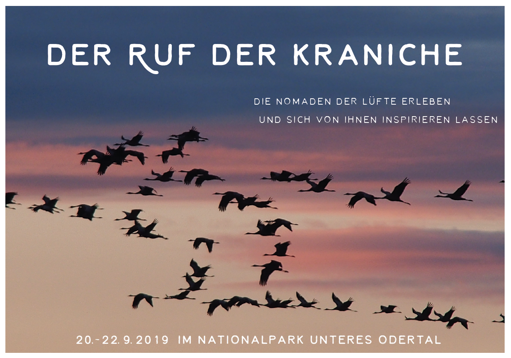

# Willkommen

Trompetenähnliche Rufe erschallen im September laut durch den Nationalpark Unteres Odertal. Die großen Nomaden der Lüfte versammeln sich und bereiten ihren Zug in den Süden vor. Wenn man ihren Unterhaltungen in der Abenddämmerung bis spät in die Nacht zuhört, wird die ansteckende Aufregung dieser Vögel spürbar.
Offensichtlich haben sie sich viel zu erzählen: was sie im Sommer erlebt haben, was aus ihren Jungen geworden ist, welche Abenteuer es zu bestehen gab und natürlich die Flugroute, die vor ihnen liegt. Ihr Rufen berührt in uns Menschen oft einen alten, tief verborgenen Nomadentrieb.
Man möchte auffliegen und mit ihnen ziehen!
 
Diesem Impuls wollen wir folgen und die Kraniche 3 Tage lang begleiten, in ihre Lebensweise eintauchen und uns davon für unser eigenes Leben inspirieren lassen.
Indem wir die Kraniche nachahmen und spielerisch in ihr Wahrnehmen, Denken und Fühlen hineingleiten, öffnet sich für uns als Menschen auf ganz einfache Art ein Zugang zu innerer Weisheit und archaischem Wissen. Es kann passieren, dass wir plötzlich Dinge wissen, von denen wir vorher keine Ahnung hatten!
Und es ist sehr erfrischend aus dieser Perspektive das eigene Leben zu betrachten.
 
Ganz praktisch wird unsere Zeit erfüllt sein von:
Wandern durch das Odertal und um den Parsteinsee – hineinfühlen in das Wesen der Kraniche – mit ihnen Futter suchen – ihre Sprache lernen – ihre Lieblingsschlafplätze kennenlernen – austauschen, was uns berührt – den Antworten der Natur auf unsere Lebensthemen lauschen und das wundervolle Abendkonzert der Kraniche erleben, wenn sie einfliegen zu ihren Schlafplätzen.
Herzlich Willkommen!

### Veranstaltungsdaten
 
Termin: 20.9.-22.9.2019  
Start: Freitag um 16:00 Uhr  
Ende: Sonntag um 15:00 Uhr  
Ort: Alte Schmiede, Gutshof 3, 16248 Stolzenhagen/Nationalpark Unteres Odertal  
Kosten: 195 €, zzgl. ÜVP  
Frühbucherrabatt (bis 31.3.19): 180 €  
Verpflegung (vegetarische Vollwertkost): 45 €  
Übernachtung: Matratzenlager in Alter Schmiede oder Zelt (5 €/Nacht); alternativ: Gästezimmer oder FeWos in Laufweite in Stolzenhagen. Liste der Anbieter schicken wir auf Anfrage gerne zu.
 
### Mentoren
Birgit Anna Rabold & Team  
(Natur- und Wildnispädagogin, Coach)
 
### Kontakt & Anmeldung
Die Wilde Möhre  
Wildkräuter- & Wildniswerkstatt  
Tel.: 0176-78019844  
Email: [info@die-wilde-moehre.de](mailto:info@die-wilde-moehre.de)
 
Der Nationalpark Unteres Odertal ist als bedeutsames Brut-, Rast- und Überwinterunsgebiet für Vögel bekannt. Im Gegensatz zu anderen Kranich-Rastplätzen finden keine Anfütterungsmaßnahmen statt, so dass die Vögel sich über die Gegend verteilen und es den Besuchern ermöglichen, Ihnen ganz familiär - sozusagen von Du zu Du - in einer wunderschönen, abwechslungsreichen Landschaft zu begegnen.

Melde dich im [Onlineformular](https://forms.office.com/Pages/ResponsePage.aspx?id=t23BlLqOhkmqw2b3S_r8nhlHjWhJtABCrIr9Nhc3jXlUQ1RLQlVBMEZUVU5CT1A1TzExVVJIR0JHNS4u) oder 
 an!
